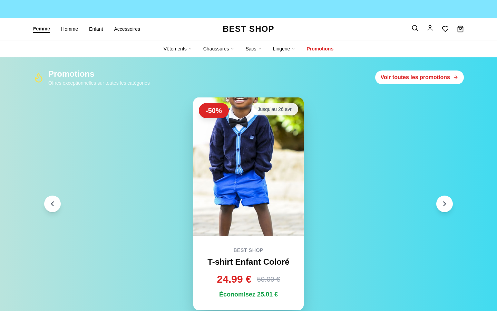
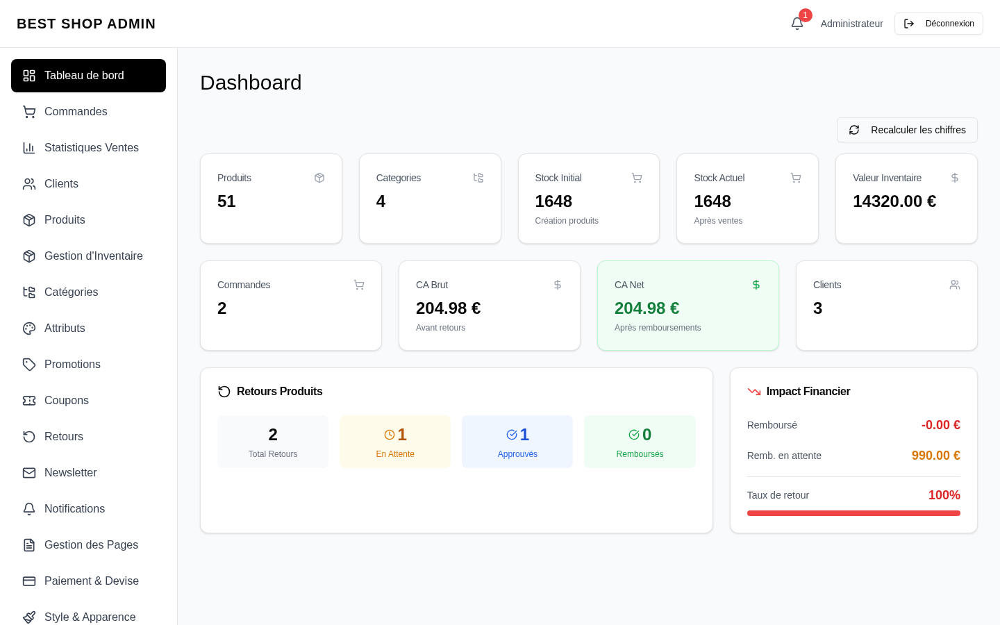

# 1. Présentation Générale / General Overview

## 🇫🇷 FRANÇAIS

### Qu'est-ce que Best Shop ?

**Best Shop** est une plateforme e-commerce **full-stack** complète, pensée pour les boutiques de mode (vêtements, chaussures, accessoires). Elle offre :

- Une **boutique en ligne** publique (catalogue, panier, tunnel de paiement)
- Une **interface d'administration** pour gérer les produits, commandes, clients, contenus et paramètres
- Des **emails transactionnels** (vérification de compte, réinitialisation mot de passe, confirmation de commande)
- Un **système de notifications** admin (in-app, Telegram, WhatsApp)
- Une **gestion multi-rôles** avec permissions granulaires

### Architecture globale

```
┌─────────────────────────┐        ┌─────────────────────────┐
│   Frontend (React)      │        │   Backend (FastAPI)     │
│   - Tailwind + shadcn   │◀──────▶│   - JWT Auth            │
│   - React Router        │  HTTPS │   - Rate Limiting       │
│   - Responsive          │   +    │   - CSP Headers         │
└─────────────────────────┘  JWT   └───────────┬─────────────┘
                                               │
                                    ┌──────────▼──────────┐
                                    │   MongoDB           │
                                    │   - Users/Orders    │
                                    │   - Products        │
                                    │   - Settings        │
                                    └─────────────────────┘
                                               │
                           ┌───────────────────┴───────────────────┐
                           │                                       │
                    ┌──────▼──────┐                         ┌──────▼──────┐
                    │   Resend    │                         │   Stripe    │
                    │   (Emails)  │                         │   (Payment) │
                    └─────────────┘                         └─────────────┘
                    + Telegram, WhatsApp, Google OAuth
```

### Public cible

- **Boutiques indépendantes** cherchant une alternative à Shopify sans frais mensuels
- **Développeurs** souhaitant partir d'une base solide pour un projet sur-mesure
- **Investisseurs** cherchant un MVP e-commerce fonctionnel prêt à scaler

### Chiffres clés

| Métrique | Valeur |
|---|---|
| Lignes de code backend Python | ~15 000 |
| Lignes de code frontend React | ~30 000 |
| Endpoints API | 100+ |
| Pages admin | 19 |
| Pages publiques | 12+ |
| Tests unitaires | Oui |
| Mobile responsive | 100% |
| Score sécurité | **9/10** |

---

## 🇬🇧 ENGLISH

### What is Best Shop?

**Best Shop** is a complete **full-stack** e-commerce platform designed for fashion boutiques (clothing, shoes, accessories). It provides:

- A public **online store** (catalog, cart, checkout)
- An **admin dashboard** to manage products, orders, customers, content, and settings
- **Transactional emails** (account verification, password reset, order confirmation)
- An **admin notification system** (in-app, Telegram, WhatsApp)
- **Multi-role management** with granular permissions

### Overall Architecture

See diagram above (identical to French section).

### Target audience

- **Independent boutiques** seeking a monthly-fee-free alternative to Shopify
- **Developers** wanting a solid base for custom projects
- **Investors** looking for a functional e-commerce MVP ready to scale

### Key figures

| Metric | Value |
|---|---|
| Backend Python lines of code | ~15,000 |
| Frontend React lines of code | ~30,000 |
| API endpoints | 100+ |
| Admin pages | 19 |
| Public pages | 12+ |
| Unit tests | Yes |
| Mobile responsive | 100% |
| Security score | **9/10** |

---

## 📸 Aperçu / Preview

### Homepage (Desktop)


### Admin Dashboard

