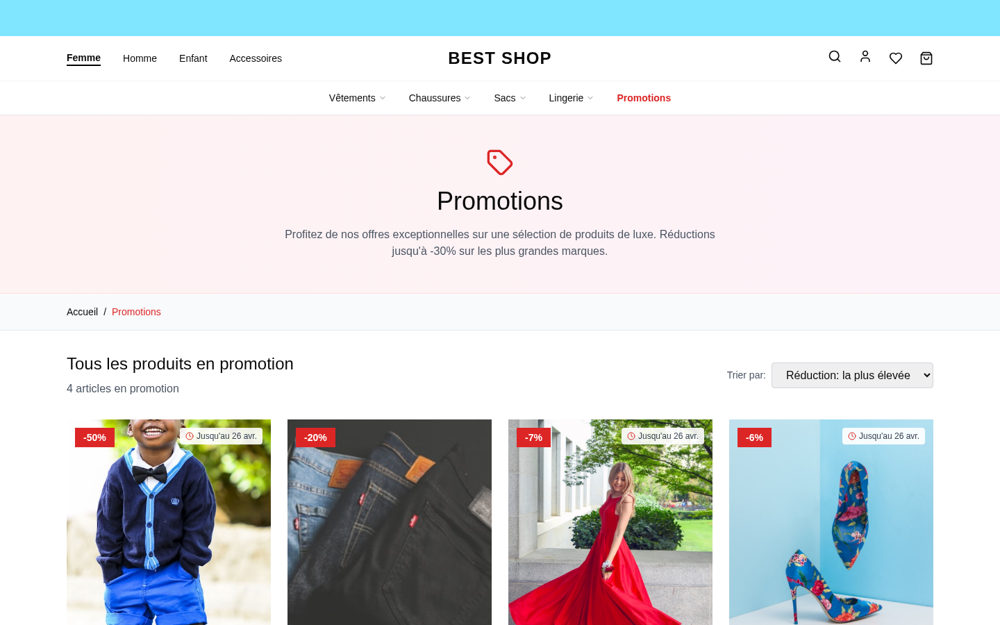
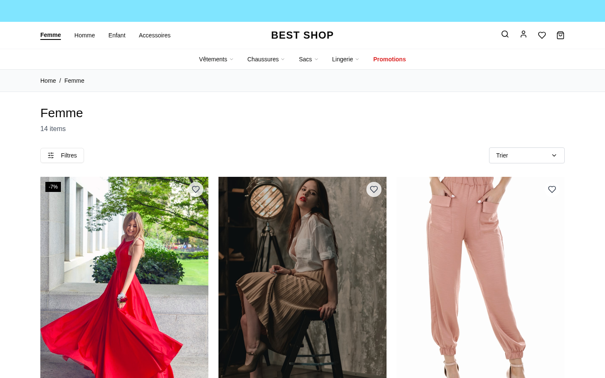
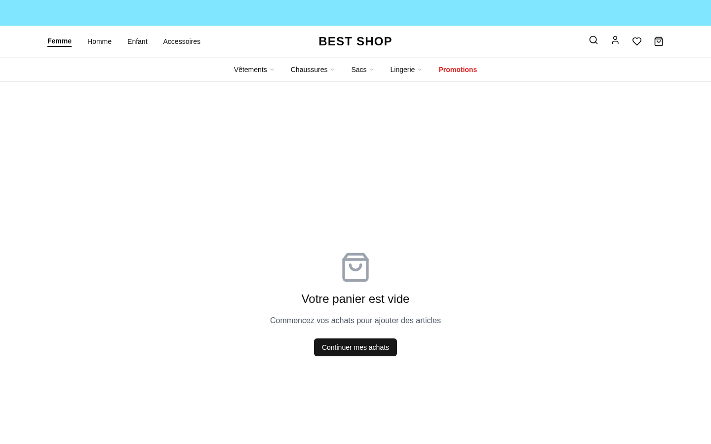
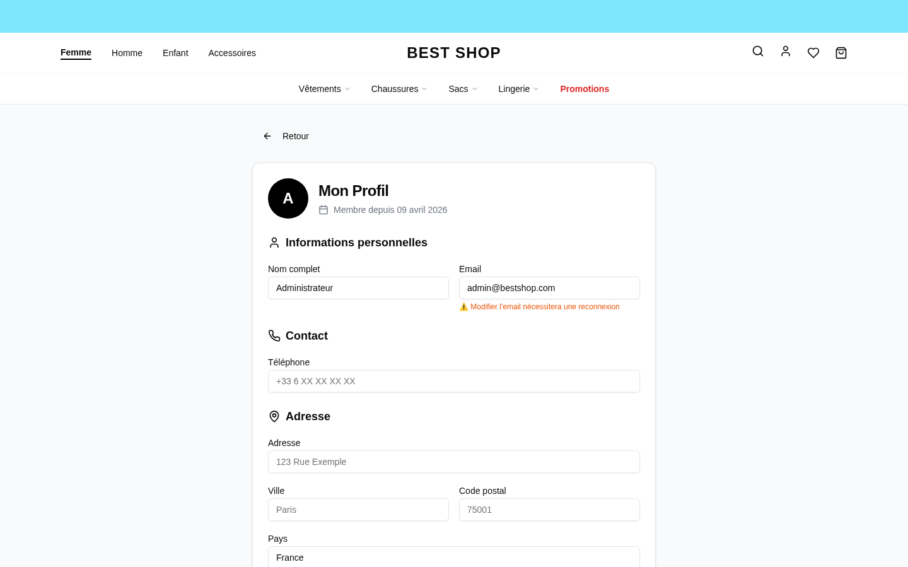
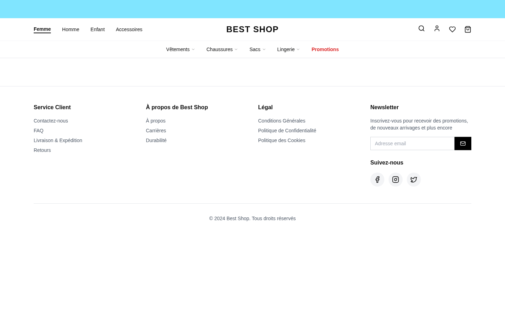
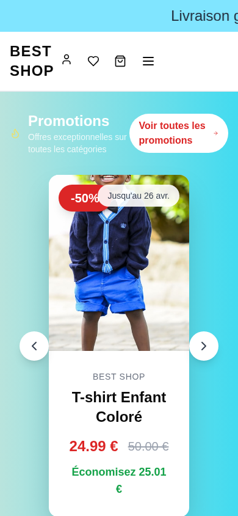

# 2. Fonctionnalités Client / Client Features

## 🇫🇷 FRANÇAIS — Interface Client

### 2.1 Page d'accueil
La page d'accueil présente :
- **Hero banner** avec image promotionnelle et call-to-action
- **Catégories phares** avec images cliquables
- **Produits en vedette** (nouveautés, tendances)
- **Bannière de promotion** dynamique paramétrable
- **Newsletter** (formulaire d'inscription en bas de page)

### 2.2 Page Promotions
Liste dédiée des produits en promotion avec :
- Affichage du prix barré + prix remisé
- Badge pourcentage de réduction
- Tri et filtrage

### 2.3 Pages catégorie
Navigation par catégorie (Femme, Homme, Enfant, Accessoires) avec :
- Grille de produits responsive
- Filtres par taille, couleur, marque, prix
- Pagination

### 2.4 Fiche produit
- Galerie d'images (zoom, plusieurs vues)
- Sélection taille + couleur + quantité
- Description, caractéristiques, composition
- Produits similaires / recommandés
- Bouton "Ajouter au panier" + "Ajouter aux favoris"

### 2.5 Panier d'achat
- Liste des articles avec miniatures
- Modification quantité / suppression
- Calcul automatique sous-total, frais de port, total
- Code promo / coupon
- Bouton "Passer commande"

### 2.6 Tunnel de paiement (Checkout)
Tunnel en 3 étapes :
1. **Informations de livraison** (nom, adresse, ville, code postal)
2. **Mode de paiement** (Stripe, PayPal, Cash-on-Delivery)
3. **Confirmation** et récapitulatif

### 2.7 Compte utilisateur
Chaque client peut :
- **S'inscrire** (email + mot de passe, vérification par email)
- Se connecter via **Google OAuth**
- Gérer son **profil** (nom, téléphone, adresse)
- Consulter **ses commandes** avec suivi en temps réel
- Demander un **retour** produit

### 2.8 Mes Commandes
- Historique complet avec statut (En traitement, Expédié, Livré, etc.)
- Facture PDF téléchargeable
- Demande de retour en un clic

### 2.9 Expérience Mobile

Toute l'expérience client est optimisée pour mobile (iPhone, Android) et tablette.

### 2.10 Pages statiques paramétrables
- À propos / About
- Conditions Générales de Vente (CGV)
- Politique de confidentialité (RGPD)
- Contact (formulaire qui envoie un email)
- FAQ
- Mentions légales

Le contenu de chaque page est **éditable depuis l'admin** (WYSIWYG).

---

## 🇬🇧 ENGLISH — Client Interface

### 2.1 Homepage
The homepage features:
- **Hero banner** with promotional image and call-to-action
- **Featured categories** with clickable images
- **Featured products** (new arrivals, trending)
- **Dynamic promo banner** configurable from admin
- **Newsletter** signup form at the bottom

(see screenshot `01_home.png`)

### 2.2 Promotions page
Dedicated list of discounted products with:
- Strikethrough price + discounted price display
- Discount percentage badge
- Sorting and filtering

### 2.3 Category pages
Navigation by category (Women, Men, Kids, Accessories):
- Responsive product grid
- Filters by size, color, brand, price
- Pagination

### 2.4 Product detail page
- Image gallery (zoom, multiple views)
- Size + color + quantity selection
- Description, specs, composition
- Similar / recommended products
- "Add to Cart" + "Add to Wishlist" buttons

### 2.5 Shopping Cart
- Items list with thumbnails
- Modify quantity / remove
- Automatic subtotal, shipping, total calculation
- Promo code / coupon input
- "Checkout" button

### 2.6 Checkout flow
3-step checkout:
1. **Shipping info** (name, address, city, ZIP)
2. **Payment method** (Stripe, PayPal, Cash-on-Delivery)
3. **Confirmation** and summary

### 2.7 User account
Each customer can:
- **Register** (email + password, email verification)
- Login via **Google OAuth**
- Manage their **profile** (name, phone, address)
- View **their orders** with real-time tracking
- Request a product **return**

### 2.8 My Orders
- Complete history with status (Processing, Shipped, Delivered, etc.)
- Downloadable PDF invoice
- One-click return request

### 2.9 Mobile Experience

The entire client experience is optimized for mobile (iPhone, Android) and tablet — see `40_mobile_home.png`.

### 2.10 Configurable static pages
- About
- Terms & Conditions (T&C)
- Privacy policy (GDPR)
- Contact (form that sends email)
- FAQ
- Legal notice

Each page content is **editable from admin** (WYSIWYG).
